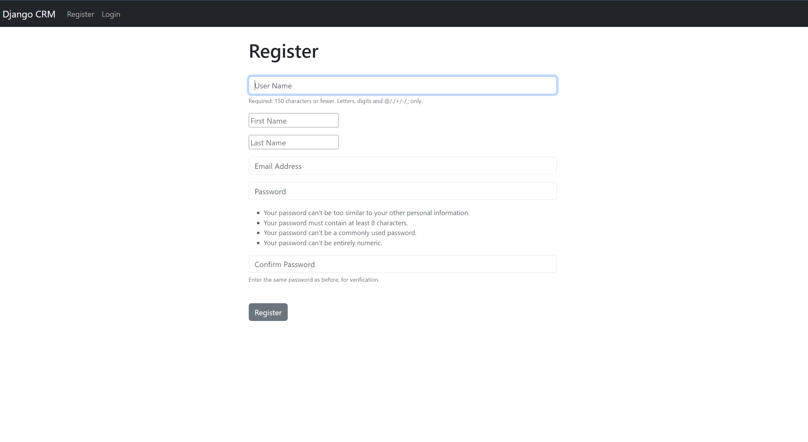
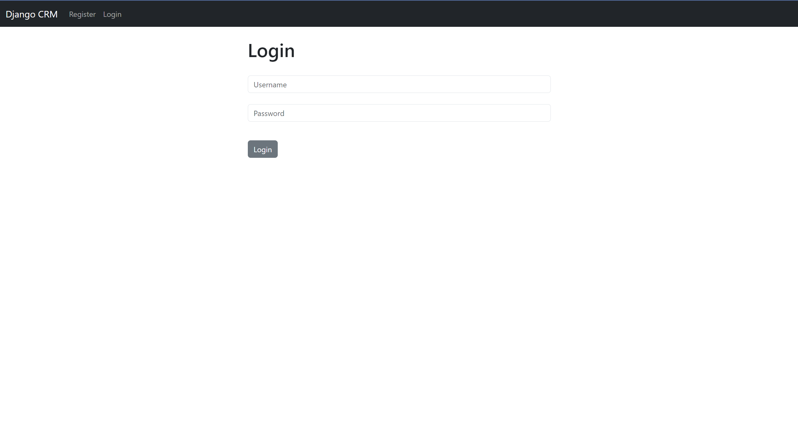
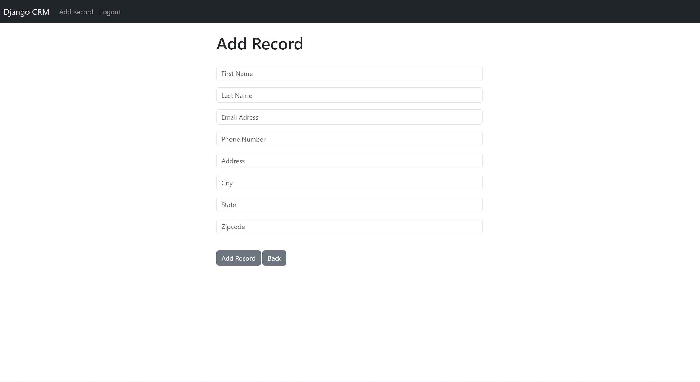
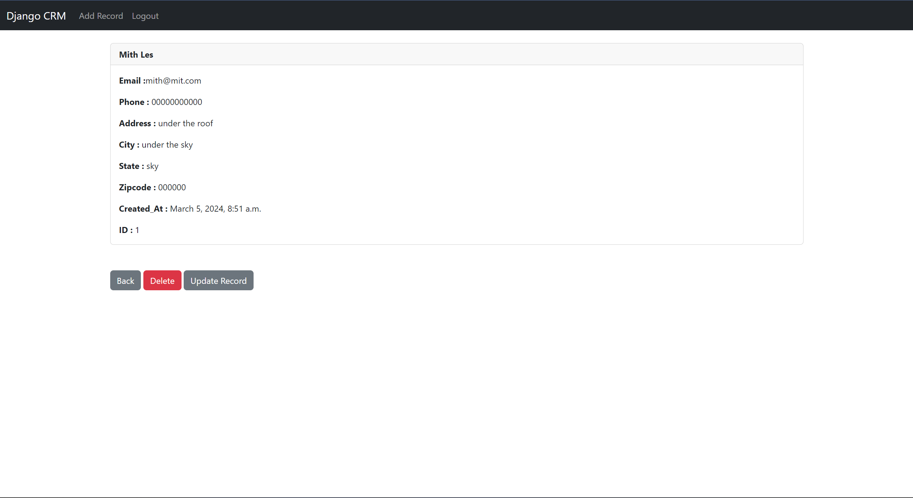
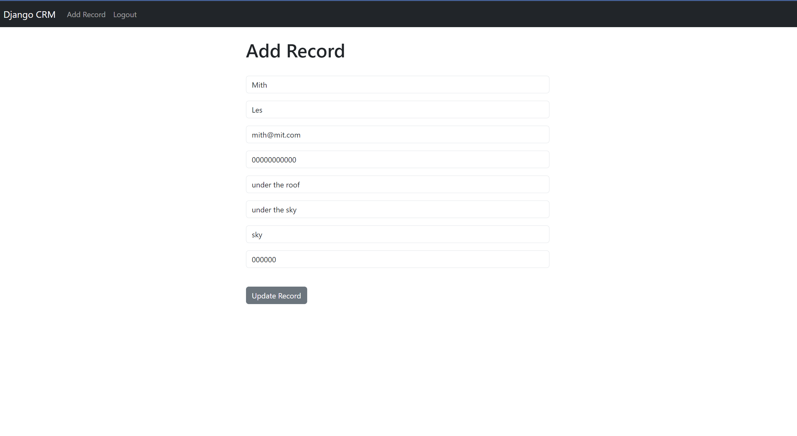

# CRM App

This CRM (Customer Relationship Management) app provides a user-friendly interface for managing customer data. Users can register, login, add customer data, view, update, and delete customer records, and logout securely.

## Features

- **User Registration**: New users can create an account by providing their email address and a secure password.

- **User Login**: Registered users can log in securely using their email address and password.

- **Add Customer Data**: Authenticated users can add new customer data, including customer name, contact information, and other relevant details.

- **View Customer Data**: Users can view a list of all customer records, displaying key information such as customer name, contact details, and additional notes.

- **Update Customer Data**: Users can update existing customer records, modifying customer information as needed.

- **Delete Customer Data**: Users can delete customer records, removing outdated or irrelevant data from the system.

- **Logout Functionality**: Users can securely log out of their accounts to protect their privacy and prevent unauthorized access.

## Technologies Used

- **Django**: The CRM app is built using the Django web framework, providing a robust and scalable solution for managing customer data.

- **Django Authentication**: Django's built-in authentication system is used to handle user registration, login, and logout functionalities securely.

- **MYSQL Database**: Customer data is stored in an MySql database, ensuring efficient data management and retrieval.

- **HTML/CSS**: The user interface is designed using HTML and CSS, providing a visually appealing and intuitive experience for users.

## Getting Started

To run the CRM app locally on your machine, follow these steps:

1. **Clone the Repository**: Clone the CRM app repository to your local machine using the following command:
   ```
   git clone https://github.com/Mithileshcs/CRM.git
   ```

2. **Install Dependencies**: Navigate to the project directory and install the required dependencies using:
   ```
   pip install -r requirements.txt
   ```

3. **Run Migrations**: Configure the database configurations and apply database migrations to create the necessary database schema:
   ```
   python manage.py migrate
   ```

4. **Create a Superuser**: Create a superuser account to access the Django admin interface and manage user accounts:
   ```
   python manage.py createsuperuser
   ```

5. **Run the Development Server**: Start the development server to run the CRM app locally:
   ```
   python manage.py runserver
   ```

6. **Access the App**: Open a web browser and navigate to `http://localhost:8000` to access the CRM app. You can log in with your superuser account to begin using the app.


## Images:

-**User Registration**




-**User Login**




-**Add Customer Data**




-**View Customer Data**

-users can view, update and delete records




-**Update Customer Data**




